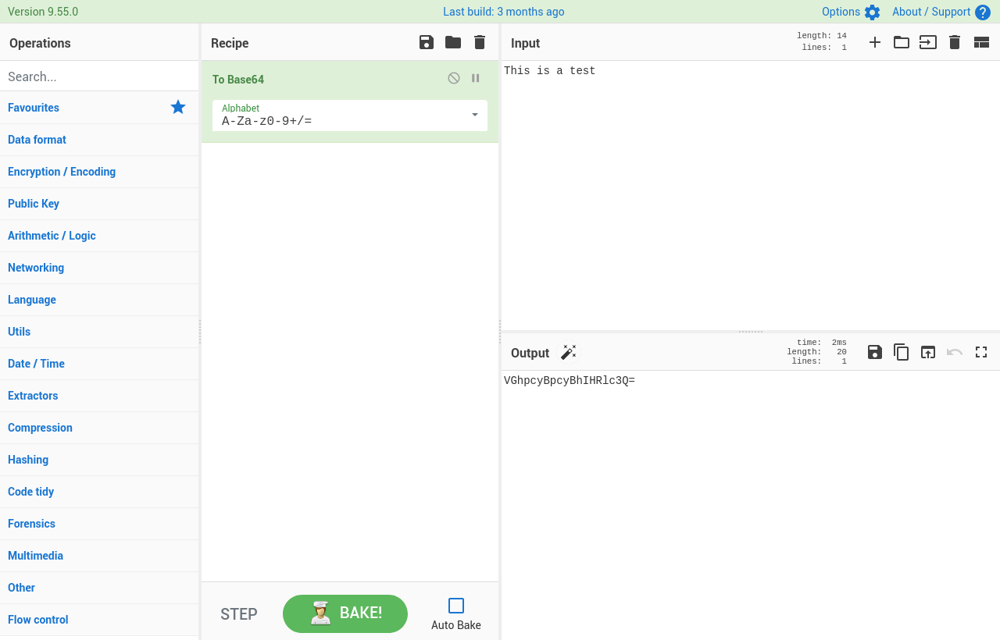

<!--
N.B.: This README was automatically generated by https://github.com/YunoHost/apps/tree/master/tools/readme_generator
It shall NOT be edited by hand.
-->

# CyberChef for YunoHost

[](https://dash.yunohost.org/appci/app/cyberchef)  

[](https://install-app.yunohost.org/?app=cyberchef)

*[Lire ce readme en français.](./README_fr.md)*

> *This package allows you to install CyberChef quickly and simply on a YunoHost server.
If you don't have YunoHost, please consult [the guide](https://yunohost.org/#/install) to learn how to install it.*

## Overview

A simple, intuitive web app for analysing and decoding data without having to deal with complex tools or programming languages. CyberChef encourages both technical and non-technical people to explore data formats, encryption and compression: encode, decode, format data, parse data, encrypt, decrypt, compress data, extract data, perform arithmetic functions against data, etc.. There are around 300 operations in CyberChef allowing you to carry out simple and complex tasks easily.


**Shipped version:** 10.8.1~ynh1

**Demo:** https://gchq.github.io/CyberChef

## Screenshots



## Documentation and resources

* Official user documentation: <https://github.com/gchq/CyberChef/wiki>
* Upstream app code repository: <https://github.com/gchq/CyberChef>
* YunoHost Store: <https://apps.yunohost.org/app/cyberchef>
* Report a bug: <https://github.com/YunoHost-Apps/cyberchef_ynh/issues>

## Developer info

Please send your pull request to the [testing branch](https://github.com/YunoHost-Apps/cyberchef_ynh/tree/testing).

To try the testing branch, please proceed like that.

``` bash
sudo yunohost app install https://github.com/YunoHost-Apps/cyberchef_ynh/tree/testing --debug
or
sudo yunohost app upgrade cyberchef -u https://github.com/YunoHost-Apps/cyberchef_ynh/tree/testing --debug
```

**More info regarding app packaging:** <https://yunohost.org/packaging_apps>