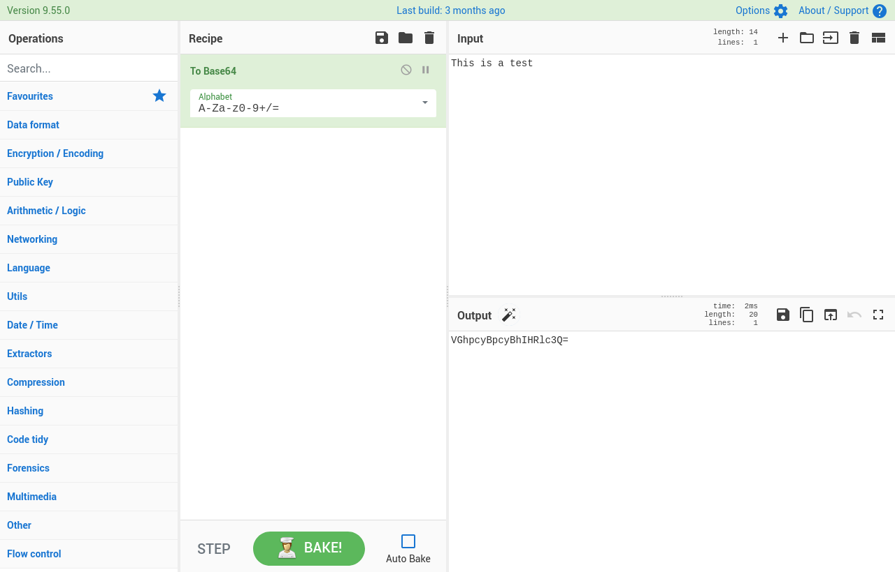

<!--
NB: Deze README is automatisch gegenereerd door <https://github.com/YunoHost/apps/tree/master/tools/readme_generator>
Hij mag NIET handmatig aangepast worden.
-->

# CyberChef voor Yunohost

[](https://ci-apps.yunohost.org/ci/apps/cyberchef/)  

[](https://install-app.yunohost.org/?app=cyberchef)

*[Deze README in een andere taal lezen.](./ALL_README.md)*

> *Met dit pakket kun je CyberChef snel en eenvoudig op een YunoHost-server installeren.*  
> *Als je nog geen YunoHost hebt, lees dan [de installatiehandleiding](https://yunohost.org/install), om te zien hoe je 'm installeert.*

## Overzicht

A simple, intuitive web app for analysing and decoding data without having to deal with complex tools or programming languages. CyberChef encourages both technical and non-technical people to explore data formats, encryption and compression: encode, decode, format data, parse data, encrypt, decrypt, compress data, extract data, perform arithmetic functions against data, etc.. There are around 300 operations in CyberChef allowing you to carry out simple and complex tasks easily.


**Geleverde versie:** 10.19.4~ynh1

**Demo:** <https://gchq.github.io/CyberChef>

## Schermafdrukken



## Documentatie en bronnen

- Officiele gebruikersdocumentatie: <https://github.com/gchq/CyberChef/wiki>
- Upstream app codedepot: <https://github.com/gchq/CyberChef>
- YunoHost-store: <https://apps.yunohost.org/app/cyberchef>
- Meld een bug: <https://github.com/YunoHost-Apps/cyberchef_ynh/issues>

## Ontwikkelaarsinformatie

Stuur je pull request alsjeblieft naar de [`testing`-branch](https://github.com/YunoHost-Apps/cyberchef_ynh/tree/testing).

Om de `testing`-branch uit te proberen, ga als volgt te werk:

```bash
sudo yunohost app install https://github.com/YunoHost-Apps/cyberchef_ynh/tree/testing --debug
of
sudo yunohost app upgrade cyberchef -u https://github.com/YunoHost-Apps/cyberchef_ynh/tree/testing --debug
```

**Verdere informatie over app-packaging:** <https://yunohost.org/packaging_apps>
